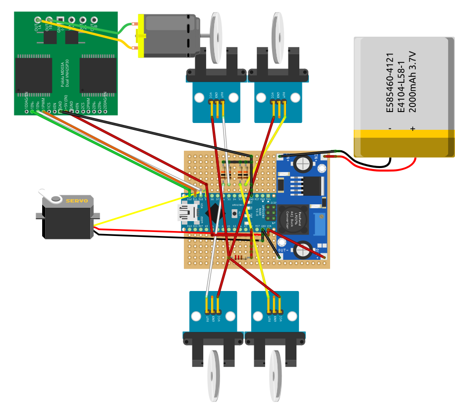

# AutonomousRacecar

This repo is the product of a 7th Semester project at AAU in collaboration with AAU Racing.
<!-- insert image here -->
This project aims to create a mockup of an autonomous race car that is capable of racing within the rules and guidelines provided by Formulastudent-AI.

## Parts

- Jetson AGX Xavier
- ZED2 Stereo Camera
- LiDAR
- Genereic RC car 
- Arduino nano
- Pololu MD01B
- 9x 18650 cells 3S3P

## Schematic

## Acknowledgements

Supervisior: Andreas Møgelmose

The dataset is Courtesy of: https://www.fsoco-dataset.com/

<!-- husk at ændre fsd_pathplanning -> config.py to change params -->

